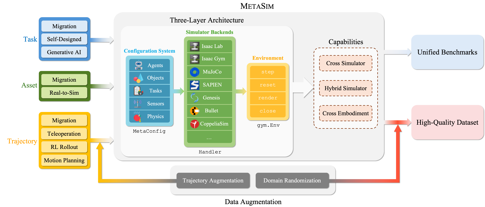

# RoboVerse


<p align="center">
  <a href="https://roboverseorg.github.io"></a>
  <a href="https://arxiv.org/abs/2504.18904"></a>
  <a href="https://roboverse.wiki"></a>
  <a href="https://github.com/RoboVerseOrg/RoboVerse/issues"></a>
  <a href="https://github.com/RoboVerseOrg/RoboVerse/discussions"></a>
  <a href="https://discord.gg/6e2CPVnAD3"></a>
  <a href="docs/source/_static/wechat.jpg"></a>
</p>

---

## What is RoboVerse?

**RoboVerse** is a unified platform for scalable and generalizable robot learning. See the [project page](https://roboverseorg.github.io) and [paper](https://arxiv.org/abs/2504.18904) for more details.

---

## Quick Start

Get started with RoboVerse in minutes:

::::{grid} 2
:gutter: 3

:::{grid-item-card} Installation
:link: metasim/get_started/installation
:link-type: doc

Set up RoboVerse with pip or Docker
:::

:::{grid-item-card} First Simulation
:link: metasim/get_started/quick_start/0_static_scene
:link-type: doc

Create your first robotic simulation
:::

:::{grid-item-card} Control a Robot
:link: metasim/get_started/quick_start/1_control_robot
:link-type: doc

Learn to control robots with actions
:::

:::{grid-item-card} Train a Policy
:link: metasim/get_started/advanced/rl_example/quick_examples
:link-type: doc

Train RL/IL policies on tasks
:::

::::

---

## Documentation Overview

::::{grid} 2
:gutter: 3

:::{grid-item-card} MetaSim User Guide
:link: metasim/index
:link-type: doc

Core simulation framework documentation including installation, tutorials, concepts, and development guides.
:::

:::{grid-item-card} Dataset & Benchmark
:link: dataset_benchmark/index
:link-type: doc

Explore tasks, robot configurations, object assets, and benchmark results.
:::

:::{grid-item-card} RoboVerse Learn
:link: roboverse_learn/index
:link-type: doc

Learning algorithms: Imitation Learning (ACT, Diffusion Policy, VLA) and Reinforcement Learning (PPO, TD3, SAC).
:::

:::{grid-item-card} API Reference
:link: API/index
:link-type: doc

Complete API documentation for MetaSim modules.
:::

::::

---

## System Architecture

<p align="center">
  
</p>

The RoboVerse ecosystem consists of three main components:

- **MetaSim**: Core simulation framework with unified API across simulators
- **RoboVerse Pack**: Pre-configured robots, tasks, and scene assets
- **RoboVerse Learn**: Integrated learning algorithms (IL & RL)

Learn more about the architecture in the [Architecture Overview](metasim/concept/architecture.md).

---

## Community & Support

- **GitHub Issues**: [Report bugs or request features](https://github.com/RoboVerseOrg/RoboVerse/issues)
- **GitHub Discussions**: [Ask questions and share ideas](https://github.com/RoboVerseOrg/RoboVerse/discussions)
- **Discord**: [Join our community](https://discord.gg/6e2CPVnAD3)

---

## Citation

If you find this work useful in your research, please consider citing:

```bibtex
@misc{geng2025roboverse,
      title={RoboVerse: Towards a Unified Platform, Dataset and Benchmark for Scalable and Generalizable Robot Learning}, 
      author={Haoran Geng and Feishi Wang and Songlin Wei and Yuyang Li and Bangjun Wang and Boshi An and Charlie Tianyue Cheng and Haozhe Lou and Peihao Li and Yen-Jen Wang and Yutong Liang and Dylan Goetting and Chaoyi Xu and Haozhe Chen and Yuxi Qian and Yiran Geng and Jiageng Mao and Weikang Wan and Mingtong Zhang and Jiangran Lyu and Siheng Zhao and Jiazhao Zhang and Jialiang Zhang and Chengyang Zhao and Haoran Lu and Yufei Ding and Ran Gong and Yuran Wang and Yuxuan Kuang and Ruihai Wu and Baoxiong Jia and Carlo Sferrazza and Hao Dong and Siyuan Huang and Yue Wang and Jitendra Malik and Pieter Abbeel},
      year={2025},
      eprint={2504.18904},
      archivePrefix={arXiv},
      primaryClass={cs.RO},
      url={https://arxiv.org/abs/2504.18904}, 
}
```

<!-- ## Table of Contents -->
```{toctree}
:hidden:
:titlesonly:

metasim/index
dataset_benchmark/index
roboverse_learn/index
API/index
FAQ/index
```
