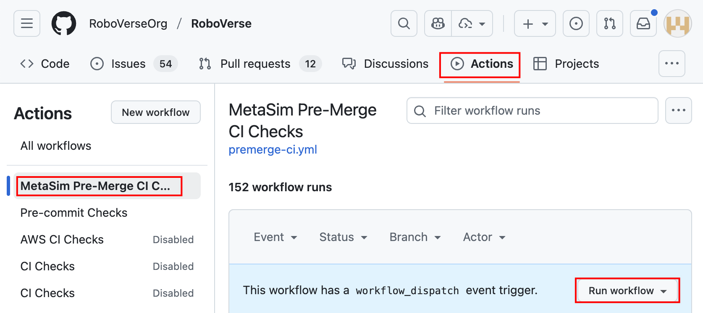

# Testing Infrastructure

## Overview

RoboVerse provides a comprehensive testing infrastructure built on pytest that enables efficient, cross-backend testing of simulation functionality. The system is designed around handler reuse and scenario sharing, dramatically reducing test execution time while maintaining full coverage across all supported simulator backends (MuJoCo, MJX, IsaacGym, IsaacSim, Newton).

Key features of the testing system include:

- **Shared Handler Architecture**: Handler instances are reused across multiple tests with the same configuration, avoiding expensive initialization overhead
- **Multi-Backend Parametrization**: Tests automatically run across specified simulator backends using pytest markers
- **Scenario-Based Organization**: Test suites are organized around shared scenarios, maximizing handler reuse
- **HandlerContext Integration**: Lifecycle management ensures consistent behavior with production code and proper cleanup

The testing infrastructure covers:
- Core simulator functionality (DOF control, gravity, kinematics, state management)
- Randomization systems (camera, light, material, object, scene)
- Query systems (contact forces, site positions)
- Utility modules (camera, dict, gaussian splatting, math, string, tensor)
- Robot configuration and scenario setup

## Test Discovery

Pytest automatically discovers and runs test functions that meet the following criteria:

- **Function naming**: Name starts with `test_` (e.g., `test_contact_forces_mujoco()`) OR method name starts with `test_` in classes named `Test*` (without `__init__`)
- **File naming**: Located in files whose names start with `test_` or end with `_test.py` (e.g., `test_site.py`, `test_contact_force.py`)
- **Directory scope**: Within the directories pytest is invoked on and their subdirectories

> **Note**: Helper functions like `_pick_robot_site_name()` or `contact_forces_mujoco_query()` are not executed as tests by pytest since they don't start with `test_`.

## Markers and Fixtures

### Test Markers

Markers declare which simulator backends a test requires:

- `@pytest.mark.mujoco`: Test runs on MuJoCo backend
- `@pytest.mark.mjx`: Test runs on MuJoCo MJX backend
- `@pytest.mark.isaacgym`: Test runs on IsaacGym backend
- `@pytest.mark.isaacsim`: Test runs on IsaacSim backend
- `@pytest.mark.newton`: Test runs on Newton backend
- `@pytest.mark.sim("sim1", "sim2")`: Test runs on multiple specified backends
- `@pytest.mark.general`: Test requires no simulator/handler (pure unit test)

### Core Fixtures

**`handler`**: Provides a shared handler instance for simulator-backed tests. The handler is reused across all tests with the same `(sim, num_envs)` configuration, providing significant performance benefits.

**`isaacsim_app`**: Session-scoped fixture that creates the IsaacSim AppLauncher when needed. Automatically provided by the central conftest.

> **Important**: Tests marked `@pytest.mark.general` should NOT request the `handler` fixture. General tests are for pure unit tests without simulators.

### Parametrization

Marker declarations combined with `get_test_parameters()` determine which `(sim, num_envs)` combinations get applied to each test. The `-k` flag filters collected tests by substring after parametrization.

## Shared Handler Architecture

### Performance Benefits

The `handler` fixture provides significant performance benefits by reusing simulator instances across multiple tests. Instead of creating and destroying a handler for every test, it creates one handler per `(sim, num_envs)` combination and reuses it for all tests in a session that share the same scenario configuration.

**Implementation**: The test infrastructure uses `HandlerContext` from `metasim/sim/sim_context.py` to manage handler lifecycle. This ensures consistent behavior with production code and proper cleanup across all simulator backends. For IsaacSim specifically, `HandlerContext` keeps handlers alive between tests (only clearing the simulation context), which avoids expensive application restarts.

### Best Practice: Group Tests by Scenario

**Why**: Tests that share the same scenario (robot configuration, environment setup, etc.) can reuse the same handler instance, dramatically reducing test execution time.

**How**: Organize all tests that need the same scenario into a single directory (or file), then register one scenario builder for that entire directory using `register_shared_suite()`.

**Example**: The `queries/` test suite has tests for contact forces, site positions, etc. All these tests use the same robot and environment setup, so they all share one handler per `(sim, num_envs)` combo.

## Test Suite Organization

### Directory Structure

```
metasim/test/
├── conftest.py                    # Central shared handler machinery
├── test_utils.py                  # get_test_parameters()
│
├── queries/                       # Suite 1: All query-related tests (ONE scenario)
│   ├── __init__.py               # REQUIRED: Makes this a Python package
│   ├── conftest.py               # Register ONE scenario for all query tests
│   ├── test_contact_force.py     # Tests using G1 robot scenario
│   ├── test_site.py              # Tests using G1 robot scenario
│
├── manipulation/                  # Suite 2: Manipulation tests (ONE scenario)
│   ├── __init__.py               # REQUIRED: Makes this a Python package
│   ├── conftest.py               # Register ONE scenario for manipulation tests
│   ├── test_gripper.py           # Tests using gripper robot scenario
│   └── test_grasping.py          # Tests using gripper robot scenario
│
└── locomotion/                    # Suite 3: Locomotion tests (MULTIPLE scenarios + general tests)
    ├── __init__.py               # REQUIRED: Makes this a Python package
    ├── conftest.py               # Register TWO scenarios: walking + running
    ├── test_walking.py           # Tests using bipedal walking scenario
    ├── test_running.py           # Tests using quadruped running scenario
    └── test_locomotion_general.py # General tests (no handler - conftest has no effect)
```

> **IMPORTANT: Every test directory MUST have an `__init__.py` file!**
>
> Without `__init__.py`, pytest treats the directory as a plain directory instead of a Python package. This causes test modules to have short names like `test_gripper` instead of `metasim.test.manipulation.test_gripper`, which breaks the `register_shared_suite()` prefix matching. If your tests fail with `AttributeError: 'SubRequest' object has no attribute 'param'`, check that all parent directories have `__init__.py` files.

### Key Design Principles

- **Single scenario per suite**: `queries/` and `manipulation/` each register ONE scenario for all tests in that directory - maximizes handler reuse and minimizes startup overhead
- **Multiple scenarios in one suite**: `locomotion/` registers TWO scenarios because walking tests need a bipedal robot while running tests need a quadruped robot. Each scenario is registered with a different prefix matching the specific test file
- **General tests can coexist**: `locomotion/test_locomotion_general.py` contains tests marked `@pytest.mark.general` that don't request the `handler` fixture. The `conftest.py` registrations have no effect on these tests since they don't use the handler

## Registering Test Suites

### Single Scenario Registration

When all tests in a directory share the same scenario, register once for the entire directory.

**In `metasim/test/manipulation/conftest.py`:**
```python
from metasim.scenario.scenario import ScenarioCfg
from metasim.test.conftest import register_shared_suite
from roboverse_pack.robots.panda_cfg import PandaCfg

def get_manipulation_scenario(sim: str, num_envs: int) -> ScenarioCfg:
    """Build scenario for all manipulation tests.

    All tests in metasim/test/manipulation/ will share this scenario,
    so we create ONE handler per (sim, num_envs) that handles gripper
    tests, grasping tests, pick-and-place tests, etc.
    """
    return ScenarioCfg(
        robots=[PandaCfg()],  # Gripper robot for manipulation
        objects=[],
        num_envs=num_envs,
        simulator=sim,
        headless=True,
        # ... other config
    )

# Register this scenario for ALL tests in the manipulation/ directory
register_shared_suite("metasim.test.manipulation", get_manipulation_scenario)
```

**In `metasim/test/manipulation/test_gripper.py`:**
```python
import pytest

@pytest.mark.mujoco
def test_gripper_open_close(handler):
    """Test gripper opening and closing."""
    # handler is the shared handler instance for this (sim, num_envs) combo
    assert handler.scenario.simulator == "mujoco"

@pytest.mark.sim("mujoco", "isaacsim")
def test_gripper_force_limits(handler):
    """Test gripper force limits on multiple backends."""
    assert handler.scenario.num_envs >= 1
```

**In `metasim/test/manipulation/test_grasping.py`:**
```python
import pytest

@pytest.mark.isaacsim
def test_grasp_cube(handler):
    """Test grasping a cube object."""
    # Reuses the same handler as other manipulation tests for isaacsim
    assert handler.scenario.simulator == "isaacsim"
```

**How it works:**
1. The central conftest finds your registration by matching the `"metasim.test.manipulation"` prefix to all test modules in that directory
2. When a test in your suite requests `handler`, pytest parametrizes it based on the test's markers (e.g., `@pytest.mark.mujoco`)
3. Your `get_manipulation_scenario(sim, num_envs)` is called once to build the scenario for each `(sim, num_envs)` combination
4. The handler is reused across all tests in `manipulation/` that have the same `(sim, num_envs)` - dramatically faster than creating a new handler for each test
5. The handler instance is passed directly to your test function via the `handler` fixture

> **Important**: Do not request `handler` on `@pytest.mark.general` tests - those are for pure unit tests without simulators.

### Multiple Scenario Registration

When tests in the same directory need different robot configurations, register multiple scenarios with different prefixes.

**In `metasim/test/locomotion/conftest.py`:**
```python
from metasim.scenario.scenario import ScenarioCfg
from metasim.test.conftest import register_shared_suite
from roboverse_pack.robots.bipedal_cfg import BipedalCfg
from roboverse_pack.robots.quadruped_cfg import QuadrupedCfg

def get_walking_scenario(sim: str, num_envs: int) -> ScenarioCfg:
    """Build scenario for bipedal walking tests."""
    return ScenarioCfg(
        robots=[BipedalCfg()],  # Bipedal robot for walking
        num_envs=num_envs,
        simulator=sim,
        headless=True,
    )

def get_running_scenario(sim: str, num_envs: int) -> ScenarioCfg:
    """Build scenario for quadruped running tests."""
    return ScenarioCfg(
        robots=[QuadrupedCfg()],  # Quadruped robot for running
        num_envs=num_envs,
        simulator=sim,
        headless=True,
    )

# Register TWO scenarios with file-specific prefixes
register_shared_suite("metasim.test.locomotion.test_walking", get_walking_scenario)
register_shared_suite("metasim.test.locomotion.test_running", get_running_scenario)
```

**In `metasim/test/locomotion/test_walking.py`:**
```python
import pytest

@pytest.mark.mujoco
def test_bipedal_gait(handler):
    """Test bipedal walking gait."""
    # Uses BipedalCfg scenario
    assert len(handler.scenario.robots) == 1

@pytest.mark.isaacsim
def test_balance_control(handler):
    """Test balance during walking."""
    # Reuses the same bipedal handler for isaacsim
    assert handler.scenario.simulator == "isaacsim"
```

**In `metasim/test/locomotion/test_running.py`:**
```python
import pytest

@pytest.mark.mujoco
def test_quadruped_trot(handler):
    """Test quadruped trotting gait."""
    # Uses QuadrupedCfg scenario (different from walking!)
    assert len(handler.scenario.robots) == 1

@pytest.mark.isaacsim
def test_high_speed_stability(handler):
    """Test stability at high running speeds."""
    # Reuses the same quadruped handler for isaacsim
    assert handler.scenario.simulator == "isaacsim"
```

The key difference: `test_walking.py` gets the bipedal scenario, `test_running.py` gets the quadruped scenario, because their full module paths match different registration prefixes.

## General Tests (No Simulator)

Tests marked `@pytest.mark.general` are pure unit tests that don't require any simulator or handler.

**In `metasim/test/locomotion/test_locomotion_general.py`:**
```python
import pytest
from metasim.utils import some_pure_function

@pytest.mark.general
def test_pure_math():
    """Test a pure function that doesn't need any simulator."""
    # NO handler fixture requested!
    result = some_pure_function(2, 3)
    assert result == 5

@pytest.mark.general
def test_config_validation():
    """Test configuration validation logic."""
    # NO handler fixture requested!
    from metasim.scenario.scenario import ScenarioCfg

    # This just tests the config class itself, no simulator needed
    cfg = ScenarioCfg(robots=[], num_envs=1, simulator="mujoco")
    assert cfg.num_envs == 1
    assert cfg.simulator == "mujoco"

@pytest.mark.general
def test_string_parsing():
    """Test string parsing utilities."""
    # NO handler fixture requested!
    from metasim.utils import parse_robot_name

    assert parse_robot_name("robot/link_1") == "robot"
```

**Key points:**
- Tests marked `@pytest.mark.general` should NEVER request the `handler` fixture
- They're for testing pure Python logic, utilities, and classes without needing a simulator
- General tests can be placed in any subdirectory alongside simulator tests
- The `conftest.py` scenario registrations have no effect on them since they don't use the `handler` fixture

## Running Tests

### Run All Tests
```bash
pytest metasim/test/
```

### Run Specific Test Categories
```bash
# Simulator tests
pytest metasim/test/sim/

# Randomization tests
pytest metasim/test/randomization/

# Query tests
pytest metasim/test/queries/

# Utility tests
pytest metasim/test/utils/
```

### Run Tests for Specific Backend
```bash
# MuJoCo only
pytest metasim/test/ -k mujoco

# IsaacGym (use entry script for proper import order)
python metasim/test/isaacgym_entry.py metasim/test/ -k isaacgym

# IsaacSim only
pytest metasim/test/ -k isaacsim

# Newton only
pytest metasim/test/ -k newton

# General tests (no simulator)
pytest metasim/test/ -k general
```

### Run Specific Test File or Function
```bash
# Single file
pytest metasim/test/sim/test_gravity.py

# Single function
pytest metasim/test/sim/test_gravity.py::test_gravity_mujoco
```

## Run test in CI

CI is automatically triggered every time a PR is ready to be merged (i.e., added to the [merge queue](https://docs.github.com/en/repositories/configuring-branches-and-merges-in-your-repository/configuring-pull-request-merges/managing-a-merge-queue)).

To launch the CI manually, please refer to [Manually running a workflow](https://docs.github.com/en/actions/how-tos/manage-workflow-runs/manually-run-a-workflow). Specifically, go to Actions tab, select the target workflow, and click the "Run workflow" button, as illustrated below.

