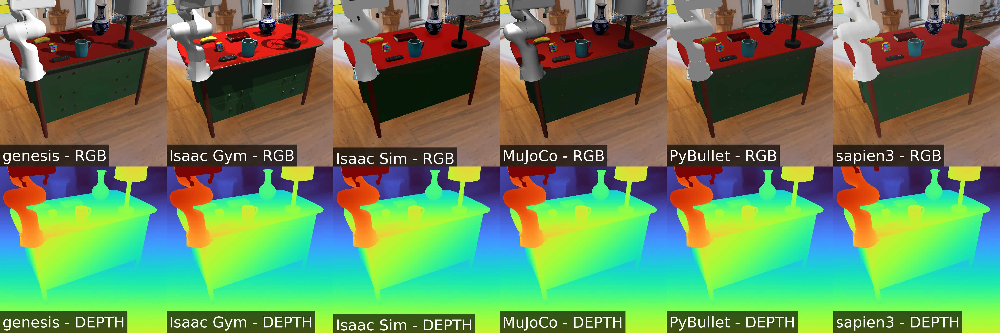

# Tutorial 15: Gaussian Splatting Backgrounds

**Objective**: Learn how to use photorealistic 3D Gaussian Splatting backgrounds for enhanced visual diversity.

**What you'll learn**:
- Setting up 3D Gaussian Splatting rendering
- Integrating GS backgrounds with robot simulations
- Improving policy generalization with diverse backgrounds

**Prerequisites**: Completed [Tutorial 14: Real Assets](14_real_asset)

**Estimated time**: 25 minutes

---

[](https://github.com/HorizonRobotics/EmbodiedGen)
[](https://horizonrobotics.github.io/EmbodiedGen/)

This tutorial demonstrates how to use 3D Gaussian Splatting (3D GS) scene assets generated by [EmbodiedGen](https://github.com/HorizonRobotics/EmbodiedGen) within MetaSim, with photorealistic rendering powered by [RoboSplatter](https://github.com/HorizonRobotics/RoboSplatter). This integration enables diverse and realistic backgrounds, enhancing the generalization of robot policies across multiple scenarios.

You can generate more 3DGS scene assets using [EmbodiedGen's 3D Scene Generation](https://github.com/HorizonRobotics/EmbodiedGen?tab=readme-ov-file#-3d-scene-generation).

## Installation

```bash
pip install -e .[robosplatter]
```

## Running the Tutorial

```bash
python get_started/15_gs_background.py  --sim <simulator>
```

In headless mode:
```bash
python3 get_started/15_gs_background.py --sim pybullet --headless
python3 get_started/15_gs_background.py --sim sapien3 --headless
python3 get_started/15_gs_background.py --sim genesis --headless
MUJOCO_GL=egl python3 get_started/15_gs_background.py --sim mujoco --headless
python3 get_started/15_gs_background.py --sim isaacgym --headless
python3 get_started/15_gs_background.py --sim isaacsim --headless
```

## Expected Output

You will get the following image:


