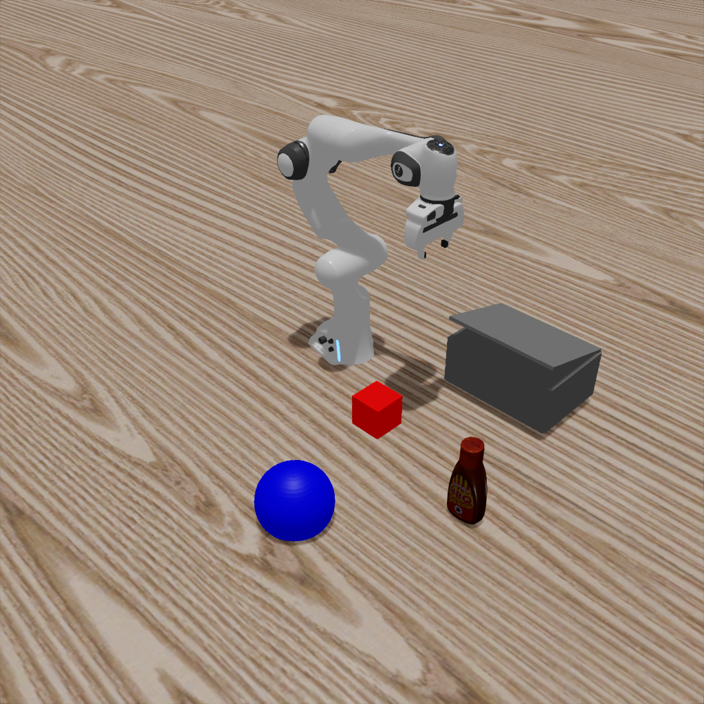
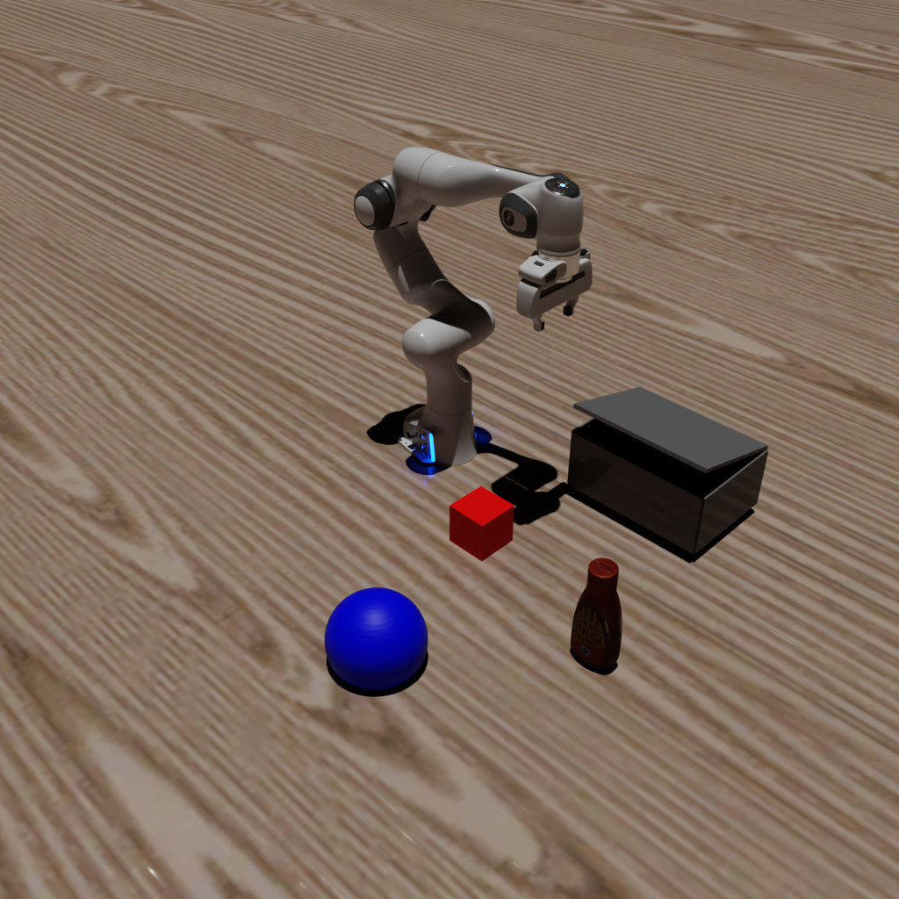

# Tutorial 6: Advanced Rendering

**Objective**: Learn how to use different rendering techniques for varying quality/performance trade-offs.

**What you'll learn**:
- Rasterization vs Ray Tracing vs Path Tracing
- Configuring render modes in MetaSim
- When to use each rendering technique

**Prerequisites**: Completed [Tutorial 5: Hybrid Simulation](5_hybrid_sim)

**Estimated time**: 20 minutes

---

MetaSim supports multiple rendering techniques through Isaac Sim's rendering backend. Choose based on your quality vs performance requirements.

| Technique | Quality | Speed | Use Case |
|-----------|---------|-------|----------|
| Rasterization | Good | Fast | Training, real-time |
| Ray Tracing | Great | Medium | Validation, demos |
| Path Tracing | Best | Slow | Final renders, sim2real |

## Running the Tutorial

```bash
python get_started/6_advanced_rendering.py  --render.mode=[rasterization|raytracing|pathtracing]
```
you can also render in the headless mode by adding `--headless` flag. By using this, there will be no window popping up and the rendering will also be faster.

By running the above command, you will simulate a hybrid system and it will automatically record a video. Here we demonstrate how to use one simulator for physics simulation and another simulator for rendering.


### Examples

#### Ray Tracing
```bash
python get_started/6_advanced_rendering.py  --render.mode=raytracing
```

#### Path Tracing
```bash
python get_started/6_advanced_rendering.py  --render.mode=pathtracing
```


You will get the following images:
---
| Ray Tracing | Path Tracing |
|:---:|:---:|
|  |  |
